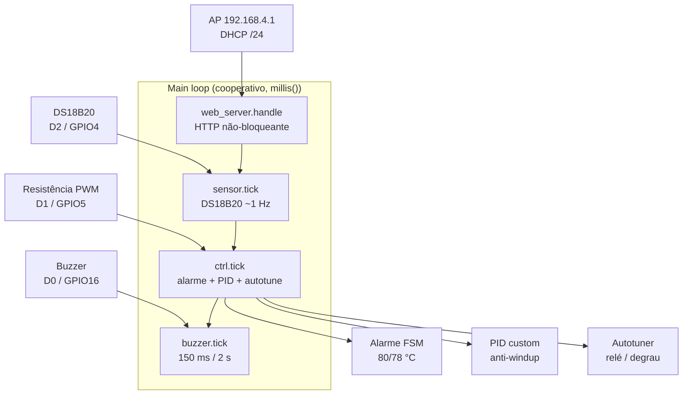
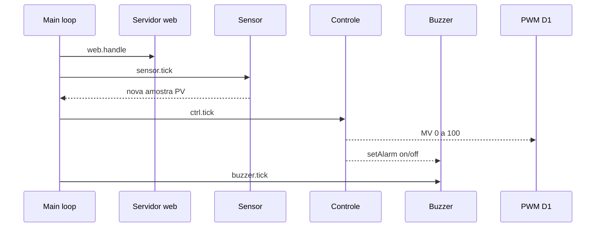
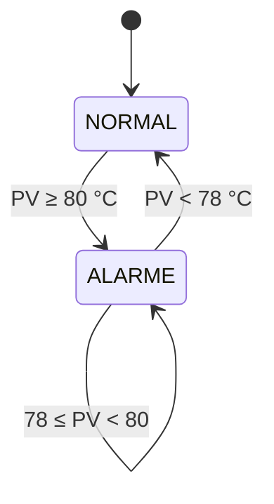
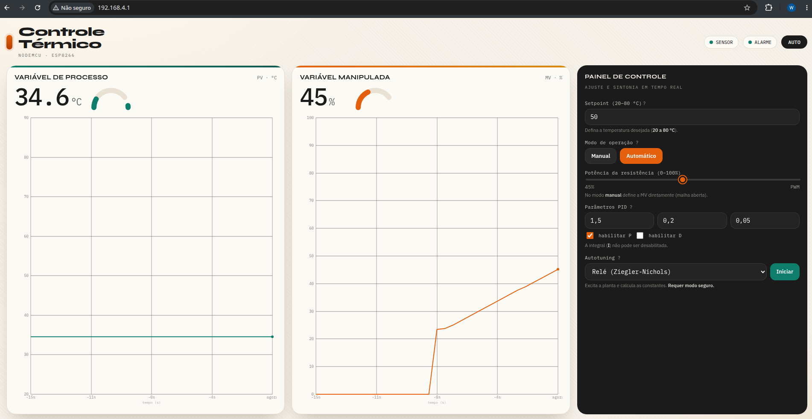

# Controle Térmico — NodeMCU ESP8266

Firmware + dashboard web embarcado para um **sistema de controle de temperatura** em malha fechada com PID, operação manual (malha aberta), autotuning e proteção por alarme com histerese. O NodeMCU opera como **Access Point** e serve um dashboard responsivo em `http://192.168.4.1`.

> Especificação, design e tarefas em `.specs/features/controle-termico/` (SDD).
> Constituição do projeto em `.specs/project/constitution.md`.

---

## 1. Visão geral

- **MCU:** NodeMCU V2 (ESP12E / ESP8266MOD), Arduino Core para ESP8266 ≥ 3.0.0, PlatformIO.
- **Controle:** PID **custom** com anti-windup (P e D habilitáveis; I sempre ativo).
- **Modos:** `MANUAL` (malha aberta), `AUTO` (malha fechada) e `TUNING` (autotuning por **relé** ou **degrau**).
- **Alarme:** ativa em **≥ 80 °C** e cessa em **< 78 °C** (histerese de 2 °C); corta a resistência e bipa **150 ms a cada 2 s** sem bloquear o loop.
- **Rede:** modo **AP** sem encriptação, IP **192.168.4.1**, máscara `/24`, DHCP na sub-rede, SSID derivado do chip ID (ex. `ESP8266-XXXXXX`), aceita **até 4 clientes simultâneos (multicliente)**; o servidor HTTP atende **requisições concorrentes** em múltiplos clientes.
- **IHM:** tema claro, **viewport única** (sem rolagem), visualização **tríplice** (numérico, gauge e gráfico) de **PV** e **MV**, com *hints* em todos os controles e **polling** `fetch` a cada 500 ms.

## 2. Arquitetura



O firmware roda **um único loop cooperativo** sem RTOS e sem `delay()` bloqueante; toda temporização usa máquinas de estado baseadas em `millis()`.

## 3. Configuração

Todas as constantes do sistema ficam centralizadas em **`src/config.h`**:

| Constante | Descrição | Padrão |
|---|---|---|
| `PIN_SENSOR_TEMP` / `PIN_HEATER_PWM` / `PIN_BUZZER` | Pinos (D2 / D1 / D0) | 4 / 5 / 16 |
| `ALARM_ON_TEMP_C` / `ALARM_OFF_TEMP_C` | Alarme ON ≥ 80 / OFF < 78 °C | 80.0 / 78.0 |
| `BUZZER_ON_MS` / `BUZZER_PERIOD_MS` | Bip 150 ms a cada 2 s | 150 / 2000 |
| `PID_PERIOD_MS` | Período determinístico do PID | 100 |
| `SETPOINT_MIN_C` / `SETPOINT_MAX_C` | Faixa do setpoint | 20 / 80 |
| `PV_MIN_C` / `PV_MAX_C` | Faixa de exibição da PV | 20 / 90 |
| `PWM_MAX` | Resolução do PWM (10 bits) | 1023 |
| `AP_*` | IP/gateway/máscara do AP | 192.168.4.1 / /24 |

**`platformio.ini`** já define o ambiente `nodemcuv2` e as dependências:

```ini
[env:nodemcuv2]
platform = espressif8266
board = nodemcuv2
framework = arduino
lib_deps =
    bblanchon/ArduinoJson@^7.0.0
    paulstoffregen/OneWire@^2.3.8
    milesburton/DallasTemperature@^3.9.0
upload_port = /dev/ttyUSB0
monitor_port = /dev/ttyUSB0
monitor_speed = 115200
```

> Se necessário, ajuste `upload_port`/`monitor_port` para o seu dispositivo.

## 4. Hardware (pinos)

| Interface | Pino | GPIO | Observação |
|---|---|---|---|
| Sensor DS18B20 | D2 | GPIO4 | OneWire |
| Resistência de aquecimento | D1 | GPIO5 | PWM 10 bits (0–1023) |
| Buzzer | D0 | GPIO16 | On/off (GPIO16 não suporta PWM) |

> **Segurança elétrica:** a resistência de aquecimento deve ser acionada por um driver adequado (MOSFET/relé), nunca diretamente pelo GPIO.

## 5. Compilar

```bash
pio run
```

Saída esperada (últimas linhas):

```
RAM:   [===       ] 36.3% (used 29752 bytes from 81920 bytes)
Flash: [===       ] 32.4% (used 337971 bytes from 1044464 bytes)
========================= [SUCCESS] Took 3.93 seconds =========================
```

## 6. Gravação (flash) e monitoramento

### 6.1 Gravar no dispositivo

```bash
pio run -t upload --upload-port /dev/ttyUSB0
```

> Se der erro de permissão, inclua o usuário no grupo `dialout`:
> `sudo usermod -a -G dialout $USER` (e faça logout/login).

### 6.2 Monitorar o serial

```bash
pio device monitor -p /dev/ttyUSB0 -b 115200
```

Exemplo de saída (o firmware imprime um status a cada 2 s):

```
[BOOT ] Sistema de controle termico inic.
[NET  ] AP: ESP8266-XXXXXX | IP: 192.168.4.1
[STATUS] PV=53.7 MV=0.0 SP=50.0 modo=manual alarm=OFF sensor=OK
[STATUS] PV=53.4 MV=0.0 SP=50.0 modo=manual alarm=OFF sensor=OK
```

## 7. Fluxo de execução no loop



> Em cada ciclo o `loop()` atende o servidor, lê o sensor de forma **assíncrona** (~1 Hz), executa o supervisor (alarme + PID/autotuning) e atualiza o buzzer. Nenhuma etapa usa `delay()` bloqueante.

## 8. Máquina de estados do alarme (histerese)



Em **ALARME**, a resistência é desligada e o buzzer bipa **150 ms a cada 2 s** (cadência não-bloqueante). A histerese de 2 °C evita *chattering* no limite.

## 9. Usar o dashboard

1. Conecte-se à rede Wi-Fi `ESP8266-XXXXXX` (sem senha).
2. Abra `http://192.168.4.1` no navegador.
3. Ajuste setpoint (20–80 °C), modo (Manual/Automático), MV manual, parâmetros PID e autotuning.

### Captura de tela (dashboard)



> Tema claro industrial, **viewport única**, visualização **tríplice** (numérico + gauge + gráfico) de **PV** e **MV**, escala de 10 em 10, grade com divisões de tempo, *hints* em todos os controles e *polling* a cada 500 ms.

## 10. API (endpoints)

| Método | Rota | Descrição |
|---|---|---|
| `GET` | `/` | Dashboard HTML |
| `GET` | `/api/state` | Estado atual (PV, MV, setpoint, modo, alarme, falha de sensor, PID) |
| `POST` | `/api/control` | Aplica configuração (JSON) |

Exemplo `GET /api/state`:

```json
{"pv":25.5,"mv":0.0,"setpoint":50.0,"mode":"manual","alarm":false,"sensor_fail":false,"ts":1234567,"pid":{"p":1.5,"i":0.2,"d":0.05,"enableP":true,"enableD":false}}
```

Exemplo `POST /api/control`:

```json
{"setpoint":55.0,"mode":"auto","pid":{"p":1.5,"i":0.2,"d":0.05,"enableP":true,"enableD":false}}
```

Regras: `setpoint` saturado em 20–80, `mv` em 0–100; valores inválidos retornam `400` sem alterar o estado.

## 11. Testes

### 11.1 HOST — lógica pura (PID, alarme, sintonia)

```bash
g++ -std=c++11 -Isrc test/host/test_core.cpp src/pid.cpp src/alarm.cpp -o /tmp/test_core && /tmp/test_core
```

Saída esperada (última linha):

```
==== 29/29 checks passaram ====
```

### 11.2 Build do alvo

```bash
pio run
```

### 11.3 Validação física (BANCADA)

> Necessita do hardware em `/dev/ttyUSB0` e de um cliente conectado ao AP.

| Teste | Como verificar | Critério |
|---|---|---|
| Rede/AP | Conectar dispositivo a `ESP8266-XXXXXX` | IP na sub-rede `192.168.4.0/24` |
| Dashboard | Abrir `http://192.168.4.1` | Renderiza sem rolagem; atualiza ~500 ms |
| `GET /api/state` | `curl http://192.168.4.1/api/state` | JSON com PV, MV, modo, alarme, sensor |
| `POST /api/control` | Enviar JSON (setpoint/modo/PID) | Aplica e retorna `200`; inválido → `400` |
| Sensor | Desconectar DS18B20 | Dashboard indica erro; resistência desliga |
| PWM | MV=100% medir em D1 | ≈1023 (0% → 0) |
| Alarme | Elevar PV até ≥80 °C | Corta resistência + bip 150 ms/2 s; desliga <78 °C |
| Autotuning | Iniciar relé/degrau | Aplica P/I/D e volta a AUTO |

## 12. Estrutura

```text
src/
├── main.cpp          # setup() + loop() (orquestra módulos)
├── config.h          # constantes (pinos, limiares, PID, rede)
├── state.h           # modelo de dados compartilhado
├── sensors.h/.cpp    # DS18B20 não-bloqueante + filtro
├── actuators.h/.cpp  # PWM + buzzer (non-blocking)
├── pid.h/.cpp        # PID custom com anti-windup
├── alarm.h/.cpp      # máquina de estados do alarme (histerese)
├── control.h/.cpp    # supervisor de controle
├── autotune.h/.cpp   # sintonia por relé / degrau (tuning_math.h)
├── tuning_math.h     # fórmulas Ziegler-Nichols e Cohen-Coon
├── web_server.h/.cpp # AP + servidor HTTP (dashboard e endpoints)
└── dashboard.h       # página web embutida (PROGMEM)
```

## 13. Segurança

- Em falha do sensor, a resistência é **desligada** e o servidor **continua respondendo**.
- Acima de **80 °C** a resistência é cortada de forma garantida, independente da rede.
- Tema claro, contraste AA e *hints* em todos os controles.
- O dashboard está embutido em `PROGMEM` (sem dependências externas de rede para funcionar no AP).

